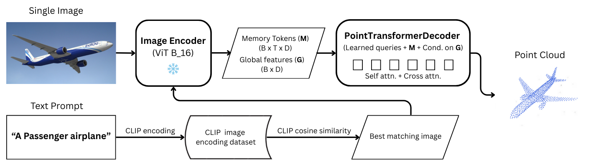

# 3D-Shape-Generation-from-Prompts

    

Our model, **"Image2PCgen"** takes an single RGB image and generates a 3D point cloud. A text-to-image retrieval pipeline is used to generate point clouds from text propmts. The model is designed with pre-trained vision transformer (ViT base_patch_16) as the image encoder and a transformer-based point cloud decoder.
